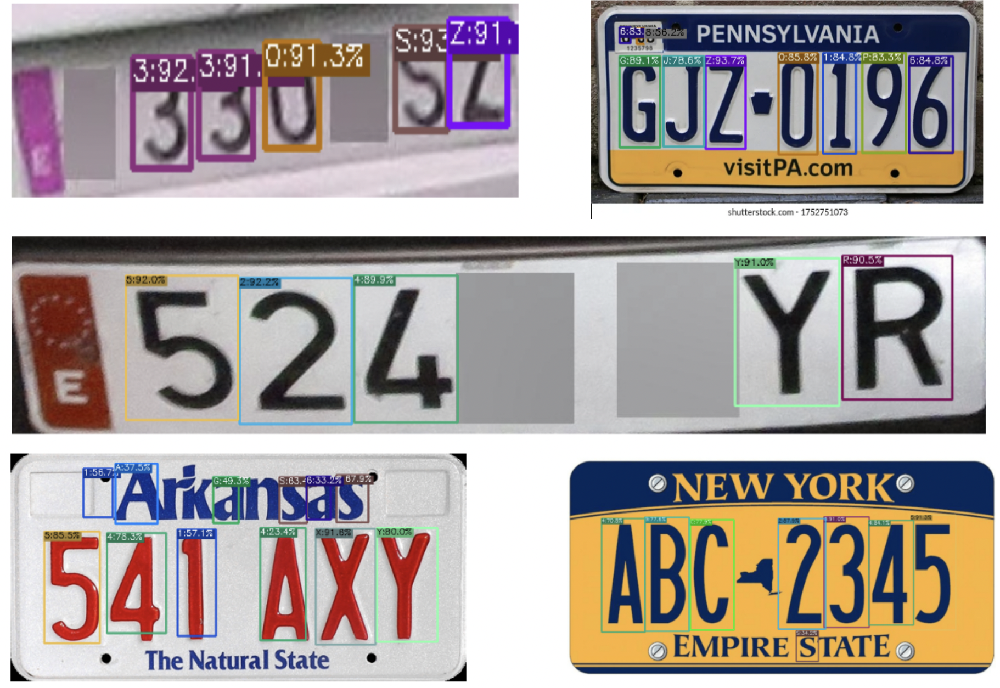

# YOLOX for Alphanumeric Character Detection on License Plates

## Overview
This repository contains the implementation and training pipeline for an alphanumeric character detection model based on YOLOX. The model is designed to localize and classify alphanumeric characters from license plates, leveraging a dataset derived from the UC3M-LP dataset, following the COCO annotation format.

## Features
- Uses YOLOX-S for balanced accuracy and computational efficiency
- Trained on a diverse character detection dataset
- Augmentations applied: mosaic, mixup, rotation, translation, scaling, shear
- Optimized with Adam optimizer
- Trained for 200 epochs on an Nvidia A100 GPU

## Dataset
The character detection dataset is derived from the UC3M-LP dataset, which provides annotated license plate images for European (Spanish) vehicles.
- **Total unique vehicles:** 2,547
- **Total annotated characters:** 12,757
- **Classes:** 0-9, A-Z (36 classes)
- **Variations:** Different lighting conditions, angles, occlusions
- **Format:** COCO dataset structure

Dataset source: [UC3M-LP Dataset](https://lsi.uc3m.es/2023/12/22/uc3m-lp-a-new-open-source-dataset/)

## Installation
```bash
# Clone the repository
git clone https://github.com/das-sunanda/YOLOX-for-Alphanumeric-Character-Detection-on-License-Plates.git
cd YOLOX-for-Alphanumeric-Character-Detection-on-License-Plates

# Install dependencies
pip install -r requirements.txt

# Setup YOLOX
cd YOLOX
python setup.py build develop
```

## Training
```bash
python tools/train.py -f exps/default/yolox_s.py -d 1 -b 16 --fp16 -o
```

## Evaluation
```bash
python tools/eval.py -f exps/default/yolox_s.py -c yolox_s.pth -b 16 -d 1 --conf 0.01 --nms 0.65
```

## Performance Metrics
```
Average forward time: 1.05 ms, Average NMS time: 0.49 ms, Average inference time: 1.54 ms
 Average Precision  (AP) @[ IoU=0.50:0.95 | area=   all | maxDets=100 ] = 0.777
 Average Precision  (AP) @[ IoU=0.50      | area=   all | maxDets=100 ] = 0.990
 Average Precision  (AP) @[ IoU=0.75      | area=   all | maxDets=100 ] = 0.958
 Average Precision  (AP) @[ IoU=0.50:0.95 | area= small | maxDets=100 ] = 0.699
 Average Precision  (AP) @[ IoU=0.50:0.95 | area=medium | maxDets=100 ] = 0.779
 Average Precision  (AP) @[ IoU=0.50:0.95 | area= large | maxDets=100 ] = 0.807
 Average Recall     (AR) @[ IoU=0.50:0.95 | area=   all | maxDets=  1 ] = 0.760
 Average Recall     (AR) @[ IoU=0.50:0.95 | area=   all | maxDets= 10 ] = 0.817
 Average Recall     (AR) @[ IoU=0.50:0.95 | area=   all | maxDets=100 ] = 0.817
 Average Recall     (AR) @[ IoU=0.50:0.95 | area= small | maxDets=100 ] = 0.731
 Average Recall     (AR) @[ IoU=0.50:0.95 | area=medium | maxDets=100 ] = 0.815
 Average Recall     (AR) @[ IoU=0.50:0.95 | area= large | maxDets=100 ] = 0.839
```

### Per-Class Average Precision (AP)
```
| class   | AP     | class   | AP     | class   | AP     |
|:--------|:-------|:--------|:-------|:--------|:-------|
| 0       | 80.554 | 1       | 68.107 | 2       | 77.374 |
| 3       | 79.659 | 4       | 77.304 | 5       | 81.441 |
| 6       | 79.270 | 7       | 77.363 | 8       | 79.281 |
| 9       | 77.750 | A       | 81.287 | B       | 78.451 |
| C       | 81.319 | D       | 76.091 | E       | nan    |
| F       | 74.240 | G       | 79.487 | H       | 79.138 |
| I       | nan    | J       | 76.719 | K       | 76.248 |
| L       | 76.500 | M       | 75.626 | N       | 74.916 |
| O       | nan    | P       | 78.617 | Q       | nan    |
| R       | 80.986 | S       | 78.880 | T       | 75.628 |
| U       | nan    | V       | 77.388 | W       | 78.024 |
| X       | 76.362 | Y       | 77.427 | Z       | 78.341 |
```
### Per-Class Average Recall (AR)
```
| class   | AR     | class   | AR     | class   | AR     |
|:--------|:-------|:--------|:-------|:--------|:-------|
| 0       | 83.813 | 1       | 74.196 | 2       | 81.314 |
| 3       | 82.701 | 4       | 81.611 | 5       | 85.034 |
| 6       | 83.020 | 7       | 81.553 | 8       | 83.117 |
| 9       | 82.078 | A       | 82.500 | B       | 82.407 |
| C       | 83.966 | D       | 79.649 | E       | nan    |
| F       | 78.571 | G       | 83.529 | H       | 83.774 |
| I       | nan    | J       | 80.755 | K       | 81.282 |
| L       | 79.412 | M       | 80.323 | N       | 81.489 |
| O       | nan    | P       | 81.887 | Q       | nan    |
| R       | 83.488 | S       | 82.632 | T       | 81.087 |
| U       | nan    | V       | 81.905 | W       | 81.111 |
| X       | 81.064 | Y       | 80.714 | Z       | 82.778 |
```

## Output Samples



## Citation
If you use this model, please cite the following:

### YOLOX Paper
```bibtex
@article{ge2021yolox,
  title={Yolox: Exceeding yolo series in 2021},
  author={Ge, Zheng and Liu, Songtao and Wang, Feng and Li, Zeming and Sun, Jian},
  journal={arXiv preprint arXiv:2107.08430},
  year={2021}
}
```

### UC3M-LP Dataset
The dataset is derived from the UC3M-LP dataset:
[UC3M-LP Dataset](https://lsi.uc3m.es/2023/12/22/uc3m-lp-a-new-open-source-dataset/)

```bibtex
@article{uc3m-lp,
  title={UC3M-LP: A New Open-Source Dataset for License Plate Detection and Recognition},
  author={UC3M-LP Team},
  journal={LSI UC3M},
  year={2023},
  url={https://lsi.uc3m.es/2023/12/22/uc3m-lp-a-new-open-source-dataset/}
}
```

## License
This project is licensed under the MIT License.
